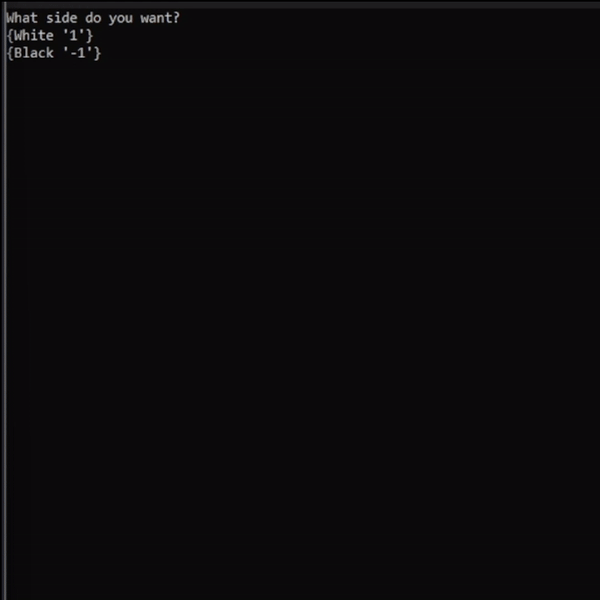
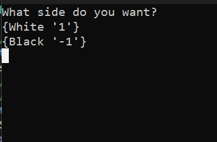
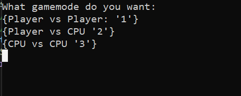

# AI Chess 🏁🤖

Play Chess against AI in your Console! ♟️🏁

## Description  📖

* Choose your starting side (White or Black)
* 3 gamemodes:
* * Player vs CPU (AI)
* * Player vs Player (Friend)
* * CPU vs CPU (Witness 2 Computers playing against each other!)

 Choosing side
 Choosing mode

## Getting Started 🚀 

### Dependencies ⬆️

* C++ compiler

### Installing 🔃

Clone this project
```bash
git clone https://github.com/SteponasK/Console-Chess
```

### Executing program 🏃‍♂️

* Change directory
```bash
    cd Console-Chess
```
* Open your favourite IDE
* Compile main.cpp file
* Choose your side.
* Enjoy!


## Help 🆘
* Possible bug:
Currently CPU vs CPU match can crash unexpectedly

## Authors 👑

* Author: Steponas K

## Version History 🏛️

* 0.2
    * Added *Player vs CPU* and *CPU vs CPU* gamemodes 
* 0.1
    * [Initial Release](https://github.com/SteponasK/Chess-CLI)

## License 📜

This project is licensed under the MIT License - see the LICENSE file for details
